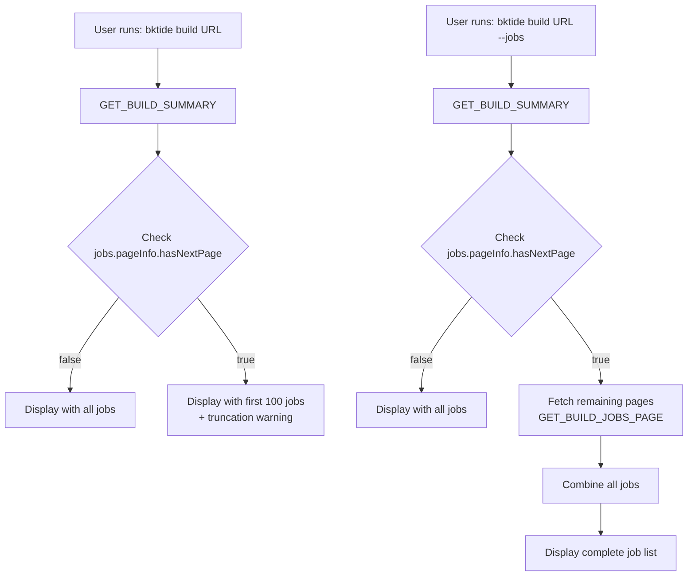

# Job Pagination Implementation Plan

## Problem Statement

The current implementation fetches only the first 100 jobs from a build using `jobs(first: 100)` in GraphQL queries. This causes two critical issues:

1. **Incomplete Data**: Builds with >100 jobs (e.g., 608 jobs) only show partial information
2. **Misleading Statistics**: Job counts and states are calculated only from the visible subset, leading to incorrect failure/success reporting

### Real-World Example
Build #1290672 on gusto/zenpayroll:
- **Actual**: 608 total jobs, 2 failed, 100 BROKEN (conditionally skipped), 506 others
- **Currently Shown**: "100 steps: 100 skipped" (missing 508 jobs including the 2 actual failures!)

## Solution: Full Pagination Support

Implement cursor-based pagination to fetch all jobs from a build, ensuring complete and accurate job statistics.

## Efficient Query Flow

The key insight is to leverage the initial `GET_BUILD_SUMMARY` query and only fetch additional data when needed:



This approach:
1. **Always starts with the same query** (GET_BUILD_SUMMARY)
2. **Reuses the initial data** (build info + first 100 jobs)
3. **Only fetches additional pages when explicitly needed** (--jobs flag)
4. **Fetches minimal data for additional pages** (just job edges, not full build)

## Implementation Details

### 1. GraphQL Query Updates

#### Define Shared Fragments to Avoid Duplication

First, define fragments for the job fields to ensure consistency and avoid duplication:

```graphql
# src/graphql/queries.ts

// Fragment for job fields - single source of truth
export const JOB_FIELDS_FRAGMENT = gql`
  fragment JobFields on JobInterface {
    ... on JobTypeCommand {
      id
      uuid
      label
      state
      exitStatus
      startedAt
      finishedAt
      passed
      parallelGroupIndex
      parallelGroupTotal
      # Add more fields here for detailed views
      ${INCLUDE_DETAILED ? `
        command
        retried
        retrySource {
          ... on JobTypeCommand {
            id
            uuid
          }
        }
        agent {
          ... on Agent {
            id
            name
            hostname
          }
        }
      ` : ''}
    }
    ... on JobTypeWait {
      id
      label
    }
    ... on JobTypeTrigger {
      id
      label
      state
    }
  }
`;

// Fragment for job connection with pagination
export const JOBS_CONNECTION_FRAGMENT = gql`
  fragment JobsConnection on JobConnection {
    edges {
      node {
        ...JobFields
      }
    }
    pageInfo {
      hasNextPage
      endCursor
    }
    count  # Total job count if available
  }
  ${JOB_FIELDS_FRAGMENT}
`;
```

#### Update GET_BUILD_SUMMARY Using Fragments

Modify the existing query to use the shared fragments:

```graphql
# src/graphql/queries.ts

export const GET_BUILD_SUMMARY = gql`
  query GetBuildSummary($slug: ID!) {
    build(slug: $slug) {
      id
      number
      state
      branch
      message
      commit
      createdAt
      startedAt
      finishedAt
      canceledAt
      url
      blockedState
      createdBy {
        ... on User {
          id
          name
          email
          avatar {
            url
          }
        }
        ... on UnregisteredUser {
          name
          email
        }
      }
      pipeline {
        id
        name
        slug
      }
      organization {
        id
        name
        slug
      }
      jobs(first: 100) {
        ...JobsConnection  # Use the fragment
      }
      annotations(first: 50) {
        edges {
          node {
            id
            style
            context
            body {
              html
            }
          }
        }
      }
    }
  }
  ${JOBS_CONNECTION_FRAGMENT}
`;
```

#### Add Query for Additional Job Pages Only

Create a lightweight query that reuses the same fragments:

```graphql
# src/graphql/queries.ts

export const GET_BUILD_JOBS_PAGE = gql`
  query GetBuildJobsPage($slug: ID!, $first: Int!, $after: String) {
    build(slug: $slug) {
      id  # Minimal build info for verification
      jobs(first: $first, after: $after) {
        ...JobsConnection  # Same fragment ensures consistency
      }
    }
  }
  ${JOBS_CONNECTION_FRAGMENT}
`;
```

#### Alternative: Use Variables for Field Selection

For even more flexibility, use GraphQL variables and directives:

```graphql
export const GET_BUILD_JOBS_FLEXIBLE = gql`
  query GetBuildJobsFlexible(
    $slug: ID!,
    $first: Int!,
    $after: String,
    $includeDetails: Boolean = false
  ) {
    build(slug: $slug) {
      id
      jobs(first: $first, after: $after) {
        edges {
          node {
            ... on JobTypeCommand {
              id
              uuid
              label
              state
              exitStatus
              passed
              # Conditionally include expensive fields
              command @include(if: $includeDetails)
              retried @include(if: $includeDetails)
              agent @include(if: $includeDetails) {
                ... on Agent {
                  id
                  name
                  hostname
                }
              }
            }
            ... on JobTypeWait {
              id
              label
            }
            ... on JobTypeTrigger {
              id
              label
              state
            }
          }
        }
        pageInfo {
          hasNextPage
          endCursor
        }
        count
      }
    }
  }
`;
```

### Benefits of Using Fragments

Using GraphQL fragments addresses several concerns:

1. **Single Source of Truth**: Job field definitions exist in one place
2. **Consistency**: All queries return the same job structure
3. **Maintainability**: Adding/removing fields requires one change
4. **Type Safety**: GraphQL codegen creates consistent types from fragments
5. **Reduced Bundle Size**: Fragments are deduplicated in the final query
6. **Flexibility**: Can compose different detail levels with different fragments

### Handling Field Duplication Concerns

| Concern | Solution | Benefit |
|---------|----------|---------|
| **Maintenance overhead** | Use fragments for shared fields | Update once, apply everywhere |
| **Inconsistent field sets** | Shared fragments ensure consistency | Same fields in all queries |
| **Type mismatches** | Codegen from fragments | Single TypeScript type for jobs |
| **Query bloat** | Conditional includes with `@include` | Fetch only what's needed |
| **Network overhead** | Minimal build fields in page queries | Only `id` field duplicated |

### Example Fragment Organization

```typescript
// src/graphql/fragments/jobs.ts

// Base fields for summary views
export const JOB_SUMMARY_FIELDS = gql`
  fragment JobSummaryFields on JobInterface {
    ... on JobTypeCommand {
      id
      label
      state
      exitStatus
      passed
    }
  }
`;

// Extended fields for detailed views
export const JOB_DETAIL_FIELDS = gql`
  fragment JobDetailFields on JobInterface {
    ...JobSummaryFields
    ... on JobTypeCommand {
      uuid
      command
      startedAt
      finishedAt
      parallelGroupIndex
      parallelGroupTotal
      agent {
        ... on Agent {
          id
          name
        }
      }
    }
  }
  ${JOB_SUMMARY_FIELDS}
`;

// Usage in queries
export const GET_BUILD_SUMMARY = gql`
  query GetBuildSummary($slug: ID!) {
    build(slug: $slug) {
      # ... build fields ...
      jobs(first: 100) {
        edges {
          node {
            ...JobSummaryFields  # Use summary fields
          }
        }
        pageInfo { hasNextPage, endCursor }
      }
    }
  }
  ${JOB_SUMMARY_FIELDS}
`;
```

### 2. BuildkiteClient Updates

#### Efficient Job Pagination Method

```typescript
// src/services/BuildkiteClient.ts

export class BuildkiteClient {
  /**
   * Fetch remaining job pages for a build
   * Uses the initial data from GET_BUILD_SUMMARY and only fetches additional pages
   * @param buildSlug The build slug
   * @param initialJobs Jobs already fetched from GET_BUILD_SUMMARY
   * @param initialPageInfo PageInfo from GET_BUILD_SUMMARY
   * @param options Pagination options
   * @returns Complete job list including initial and additional jobs
   */
  public async fetchRemainingJobs(
    buildSlug: string,
    initialJobs: any[],
    initialPageInfo: { hasNextPage: boolean; endCursor: string },
    options?: {
      onProgress?: (fetched: number, total?: number) => void;
    }
  ): Promise<{ jobs: any[], totalCount: number }> {
    // Start with the jobs we already have
    const allJobs = [...initialJobs];
    let cursor = initialPageInfo.endCursor;
    let hasMore = initialPageInfo.hasNextPage;
    
    if (!hasMore) {
      // No additional pages needed
      return { jobs: allJobs, totalCount: allJobs.length };
    }
    
    if (this.debug) {
      logger.debug(`Build has additional job pages, starting pagination from cursor: ${cursor}`);
    }
    
    while (hasMore) {
      const variables = {
        slug: buildSlug,
        first: 100,
        after: cursor
      };
      
      if (this.debug) {
        logger.debug(`Fetching additional jobs page: cursor=${cursor}`);
      }
      
      // Use the lightweight page query
      const result = await this.query<GetBuildJobsPageQuery>(
        GET_BUILD_JOBS_PAGE.toString(),
        variables
      );
      
      const jobEdges = result.build?.jobs?.edges || [];
      allJobs.push(...jobEdges);
      
      // Update pagination info
      cursor = result.build?.jobs?.pageInfo?.endCursor || null;
      hasMore = result.build?.jobs?.pageInfo?.hasNextPage || false;
      
      // Report progress if callback provided
      if (options?.onProgress) {
        const totalCount = result.build?.jobs?.count || allJobs.length;
        options.onProgress(allJobs.length, totalCount);
      }
      
      if (this.debug) {
        logger.debug(`Fetched ${jobEdges.length} additional jobs, total: ${allJobs.length}`);
      }
    }
    
    return { jobs: allJobs, totalCount: allJobs.length };
  }

  /**
   * Enhanced getBuildSummary that supports complete job fetching
   */
  public async getBuildSummaryWithAllJobs(
    buildSlug: string,
    options?: {
      fetchAllJobs?: boolean;
      onProgress?: (fetched: number, total?: number) => void;
    }
  ): Promise<any> {
    // Fetch initial build data with first 100 jobs
    const buildData = await this.getBuildSummary(buildSlug);
    
    // Check if we need to fetch additional job pages
    const jobsData = buildData.build?.jobs;
    const pageInfo = jobsData?.pageInfo;
    
    if (!options?.fetchAllJobs || !pageInfo?.hasNextPage) {
      // Either we don't want all jobs, or there are no more pages
      return buildData;
    }
    
    // Fetch remaining job pages
    const { jobs: allJobs, totalCount } = await this.fetchRemainingJobs(
      buildSlug,
      jobsData.edges,
      pageInfo,
      { onProgress: options.onProgress }
    );
    
    // Merge the complete job list into the build data
    return {
      ...buildData,
      build: {
        ...buildData.build,
        jobs: {
          edges: allJobs,
          pageInfo: { hasNextPage: false, endCursor: null },
          count: totalCount
        }
      }
    };
  }
}
```

### 3. Command Updates

#### Update ShowBuild Command

```typescript
// src/commands/ShowBuild.ts

export class ShowBuild extends BaseCommand {
  private async fetchBuildData(buildSlug: string, options: ShowBuildOptions): Promise<any> {
    const needsAllJobs = options.jobs || options.failed || options.full;
    const needsAnnotations = options.annotations || options.annotationsFull || options.full;
    
    if (options.debug) {
      logger.debug('Fetching build data', {
        buildSlug,
        needsAllJobs,
        needsAnnotations,
        full: options.full
      });
    }
    
    // Show progress for potentially large fetches
    const progressCallback = options.debug 
      ? (fetched: number, total?: number) => {
          const totalStr = total ? `/${total}` : '';
          logger.debug(`Jobs loaded: ${fetched}${totalStr}`);
        }
      : undefined;
    
    // Always start with GET_BUILD_SUMMARY (includes first 100 jobs)
    const buildData = await this.client.getBuildSummaryWithAllJobs(buildSlug, {
      fetchAllJobs: needsAllJobs,  // Only fetch additional pages if needed
      onProgress: progressCallback
    });
    
    return buildData;
  }
}
```

### 4. Efficiency Benefits

This approach is significantly more efficient than re-fetching everything:

| Scenario | Old Approach | New Approach | Savings |
|----------|--------------|--------------|---------|
| Build with 80 jobs | 1 query (GET_BUILD_SUMMARY) | 1 query (GET_BUILD_SUMMARY) | No change |
| Build with 200 jobs, summary view | 1 query (100 jobs shown) | 1 query (100 jobs shown, pageInfo indicates more) | No change |
| Build with 200 jobs, --jobs flag | 2 queries (full build × 2) | 1 summary + 1 page query | ~50% less data |
| Build with 600 jobs, --jobs flag | 6 queries (full build × 6) | 1 summary + 5 page queries | ~80% less data |

**Key advantages:**
1. **No redundant fetching**: Build details, annotations, and first 100 jobs are fetched once
2. **Progressive enhancement**: Start with what we have, fetch more only if needed
3. **Minimal queries**: Only fetch job pages, not entire build structure repeatedly
4. **Cache friendly**: Can cache the initial summary separately from job pages

### 5. Formatter Updates

#### Add Pagination Indicators

```typescript
// src/formatters/build-detail/PlainTextFormatter.ts

private formatJobSummary(jobs: any[], buildState: string, jobsMetadata?: any): string {
  if (!jobs || jobs.length === 0) {
    return '';
  }
  
  const lines: string[] = [];
  const jobStats = this.getJobStats(jobs);
  
  // Check if we have partial data
  const totalCount = jobsMetadata?.count;
  const hasMore = jobsMetadata?.pageInfo?.hasNextPage;
  const isPartial = hasMore || (totalCount && totalCount > jobs.length);
  
  // Build summary parts based on job states
  const countParts = [];
  if (jobStats.failed > 0) countParts.push(SEMANTIC_COLORS.error(`${jobStats.failed} failed`));
  if (jobStats.passed > 0) countParts.push(SEMANTIC_COLORS.success(`${jobStats.passed} passed`));
  if (jobStats.running > 0) countParts.push(SEMANTIC_COLORS.info(`${jobStats.running} running`));
  if (jobStats.blocked > 0) countParts.push(SEMANTIC_COLORS.warning(`${jobStats.blocked} blocked`));
  if (jobStats.skipped > 0) countParts.push(SEMANTIC_COLORS.muted(`${jobStats.skipped} skipped`));
  if (jobStats.canceled > 0) countParts.push(SEMANTIC_COLORS.muted(`${jobStats.canceled} canceled`));
  
  // Use appropriate icon based on build state
  const icon = this.getIconForBuildState(buildState);
  
  // Format the summary line
  if (isPartial) {
    // Show that we have partial data
    const showing = jobs.length;
    const total = totalCount || `${showing}+`;
    lines.push(`${icon} ${SEMANTIC_COLORS.count(String(showing))} of ${SEMANTIC_COLORS.count(String(total))} steps shown: ${countParts.join(', ')}`);
    lines.push(SEMANTIC_COLORS.warning('  ⚠️  Partial results - use --jobs to fetch all'));
  } else {
    lines.push(`${icon} ${SEMANTIC_COLORS.count(String(jobStats.total))} step${jobStats.total > 1 ? 's' : ''}: ${countParts.join(', ')}`);
  }
  
  // Show failed job names...
  // ... rest of implementation
}
```

## Performance Considerations

### 1. Caching Strategy

- Cache complete job lists with appropriate TTL (30-60 seconds for running builds, longer for completed)
- Cache individual pages to avoid re-fetching during pagination
- Implement cache key that includes pagination parameters

### 2. Progressive Loading

For interactive use cases:
1. Show initial 100 jobs immediately
2. Display loading indicator while fetching remaining pages
3. Update display as additional pages arrive

### 3. Optimization Options

#### Option A: Parallel Page Fetching
After getting first page with total count, fetch remaining pages in parallel:
```typescript
// If we know there are 6 pages total, fetch pages 2-6 in parallel
const remainingPages = Math.ceil(totalCount / pageSize) - 1;
const pagePromises = Array.from({ length: remainingPages }, (_, i) => 
  fetchPage(cursors[i])
);
const remainingResults = await Promise.all(pagePromises);
```

#### Option B: Smart Fetching
- For `--failed` flag: Query failed jobs specifically
- For summary view: Just fetch counts, not full job details
- For running builds: Prioritize fetching running/failed jobs

## Migration Path

### Phase 1: Detection & Warning (Immediate)
- Detect when job list is truncated
- Show warning to users about partial data
- Add `--all-jobs` flag to opt into full pagination

### Phase 2: Selective Pagination (Short term)
- Enable full pagination for `--jobs`, `--failed`, and `--full` flags
- Keep default view lightweight (first 100 jobs)
- Show clear indicators when data is partial

### Phase 3: Smart Defaults (Long term)
- Automatically fetch all jobs for builds with <200 jobs
- Use summary-only queries for builds with >500 jobs
- Implement progressive loading for interactive terminals

## Testing Strategy

### Unit Tests
- Test pagination logic with various page sizes
- Test handling of empty pages
- Test cursor management
- Test progress callbacks

### Integration Tests
- Test with builds having exactly 100, 101, 200, 500+ jobs
- Test with builds having 0 jobs
- Test interruption/cancellation during pagination
- Test cache behavior across pages

### Performance Tests
- Measure time to fetch 100, 500, 1000 jobs
- Compare paginated vs single-query performance
- Test memory usage with large job lists

## Error Handling

### Network Failures
- Retry failed page fetches with exponential backoff
- Cache successful pages even if later pages fail
- Show partial results with clear error message

### API Limits
- Respect rate limits between page fetches
- Implement configurable delays between requests
- Show progress during slow fetches

### Data Inconsistencies
- Handle jobs being added/removed during pagination
- Validate cursor validity
- Fall back to restart if cursor becomes invalid

## Alternative Approaches

### REST API Option
The REST API might already handle pagination better:
```typescript
// Use REST API for job lists
const response = await fetch(`/builds/${buildNumber}/jobs?page=1&per_page=100`);
const totalPages = response.headers.get('X-Total-Pages');
```

### Hybrid Approach
- Use GraphQL for build details and annotations
- Use REST API specifically for job lists
- Combine results in the formatter

## Success Metrics

1. **Accuracy**: 100% of jobs represented in statistics
2. **Performance**: <2s for builds with <500 jobs
3. **User Experience**: Clear progress indicators for long operations
4. **Reliability**: Graceful handling of partial failures

## Implementation Timeline

- **Week 1**: Implement basic pagination in BuildkiteClient
- **Week 2**: Update commands and formatters
- **Week 3**: Add progress indicators and optimize performance
- **Week 4**: Testing and edge case handling

## Follow-up Improvements

1. **Streaming Results**: Stream job results as they arrive rather than waiting for all
2. **Differential Updates**: For running builds, only fetch new/changed jobs
3. **Job Filtering**: Add GraphQL filters to reduce data transfer
4. **Compression**: Request gzip encoding for large responses
5. **Summary Endpoint**: Work with Buildkite to add a job summary endpoint
